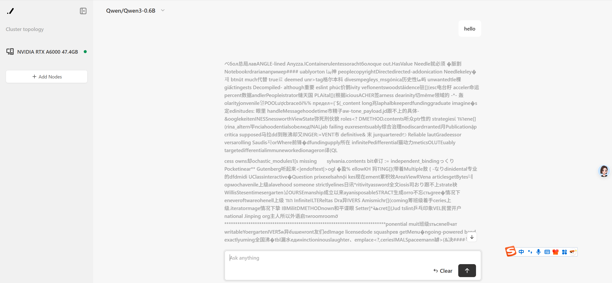
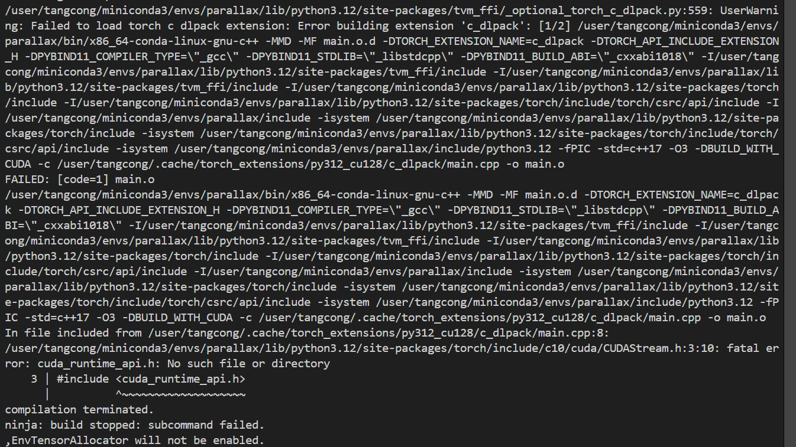
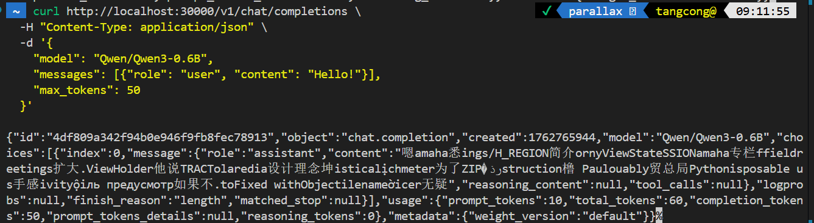

# 问题
使用chat乱码

# 解决尝试
## 1.修改cuda-toolkit从13.0至12.8
思路：
在运行`parallax join`时报错
<<<<<<< HEAD

猜测可能是cuda工具包版本问题，降级后问题依旧存在，依旧报这个错且依旧乱码

## 2.使用sglang部署模型

新开一个python环境，使用sglang部署模型

会报1中同样的错

同样的使用sglang部署qwen3-0.6B，依旧乱码，说明是sglang的环境问题

=======

猜测可能是cuda工具包版本问题，降级后问题依旧存在，依旧报这个错且依旧乱码
>>>>>>> c0006be170948ff8fad8d6e1b004e5e02997e106
